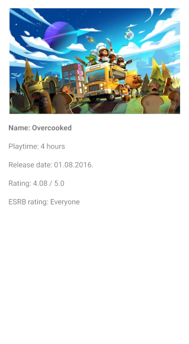

# RAWGSearch

RAWG Search is an Android application writen with Kotlin. 
User of this application can search through RAWG api which contains games on various gaming platforms.

Tools used to build this application are:
<ul>
  <li>Clean MVVM Architecture</li>
  <li>Timber - logging library</li>
  <li>Navigation - Jetpack Component</li>
  <li>RoomDB - Database component</li>
  <li>Retrofit - HTTP Client library</li>
  <li>Moshi - JSON Converting library</li>
  <li>OKHTTP Logging interceptor - Network request logging library</li>
  <li>Kotlin Coroutines - Concurrency handling library</li>
  <li>Picasso - Image loading library</li>
</ul>

When app is launched genre list is being fetched from the network and is stored in the database. On first screen the user is prompted to select at least one genre to proceed with game selection. If user has selected genres before, his opening screen will show list of games from former genre selection.

  

When genre is selected, user can pick the game from the list within selected genre('s). At bottom right corner of the list is a button which takes user back to genre selection screen.

  

If the game was selected, user can see the details of the game. Details contain image, title, playtime, release date, rating and ESRB rating.

  

